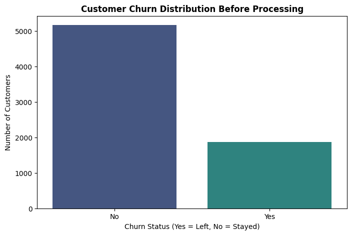
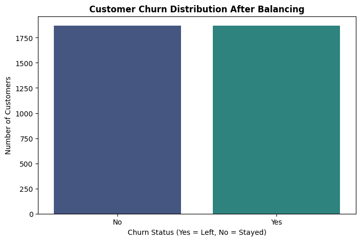
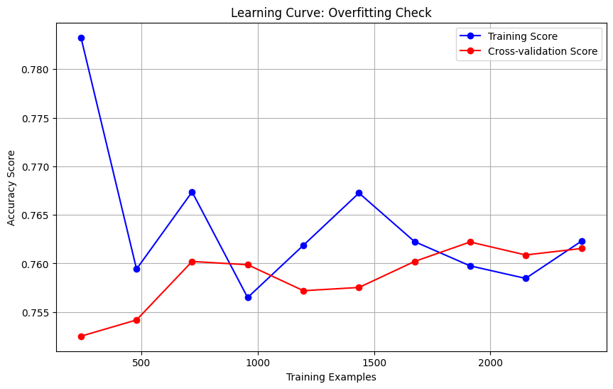
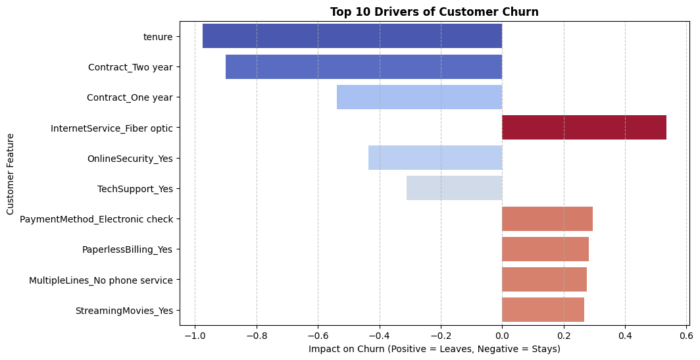

# PRODIGY_ML_Advance_internship_Task2

## 📌 Objective
The goal of this project is to build a production-ready, end-to-end Machine Learning pipeline using Scikit-learn to predict customer churn based on the Telco Customer Churn dataset.

## 📊 Dataset & Preprocessing
**Source:** Telco Customer Churn Dataset (IBM)

**1. Original Data Distribution:**
Before processing, the dataset was highly imbalanced, with a vast majority of customers categorized as "No Churn." Training on this raw data would have caused the model to heavily favor the majority class.

**2. Data Balancing:**
To prevent the model from developing a bias, an undersampling technique was applied to perfectly balance the dataset, ensuring equal representation of both classes.

**3. Automated Pipeline Preprocessing:**
To prevent data leakage and ensure seamless deployment, all preprocessing was embedded directly into a Scikit-learn `Pipeline` using a `ColumnTransformer`:
* **Numeric Features** (`tenure`, `MonthlyCharges`, `TotalCharges`): Processed using `StandardScaler`.
* **Categorical Features**: Processed using `OneHotEncoder` (dropping the first column to avoid multicollinearity).

## 🧠 Methodology & Approach
* **Model Selection:** We evaluated multiple algorithms, specifically comparing Logistic Regression against ensemble methods like Random Forest and XGBoost. 
* **Hyperparameter Tuning:** A rigorous `GridSearchCV` (with 5-fold Cross-Validation) was utilized to find the optimal hyperparameters (`C` value and `solver`) for our chosen model.
* **The Occam's Razor Decision:** Despite the complexity of XGBoost, the tuned **Logistic Regression** model achieved superior accuracy. We opted for the simpler, highly interpretable model for our final production pipeline.

## 📉 Overfitting Check
To ensure the model was generalizing well and not just memorizing the training data, we generated a learning curve. The convergence of the training and cross-validation scores confirms that the model has low variance and is not overfitting.

## 📈 Key Results & Insights
* **Final Accuracy:** 76.87% (on a strictly balanced test set)
* **Interpretability:** Because we used Logistic Regression, we were able to extract the exact coefficients to determine the primary drivers of customer churn. 

## 📦 Model Access & Deployment
The fully trained Scikit-learn pipeline (including all scaling and encoding rules) has been exported using the `joblib` library. 

The complete model is available directly in this repository as `churn_prediction_pipeline.joblib`. It can be loaded in just two lines of code for immediate predictions on new raw data, making it completely production-ready.

## 🛠️ Tech Stack
* **Language:** Python
* **Libraries:** Scikit-learn, Pandas, NumPy, Matplotlib, Seaborn, Joblib

## 👩‍💻 Author
**Subhan Ali**
* **Email:** subhan034749@gmail.com
